<div align="center">

# String Cosmology Communication

**A Manim library for visualizing string and braneworld cosmology**

<a href="https://www.buymeacoffee.com/panopepino" target="_blank">
  
</a>

[Documentation](https://panopepino.github.io/string_cosmo_communication/) • [Examples](#examples) • [Installation](#installation)

</div>


## 📚 About String Cosmology Communication

This repository contains **String Cosmology Communication** (formerly mtheoretical), a Manim library designed for creating animations and visualizations of string theory and braneworld cosmology concepts.

The package provides scientifically accurate objects and templates to help researchers communicate theoretical physics ideas through engaging animations.

The main idea is to use this package together with [Beanim](https://panopepino.github.io/beanim/index.html) to create presentation slides for string cosmology research communication.

> **📦 Package Name**  
> The package is imported as **manim_string_cosmo** in your Python files.


## ✨ Key Features

### String Cosmology Objects

- **🌌 Branes**: Domain walls, D-branes, and brane configurations
- **🌠 Vacuum States**: Different vacuum configurations and transitions
- **💥 Bubble Universes**: Nucleation and bubble collisions
- **⚫ Black Holes**: Higher-dimensional black holes
- **🔴 AdS Spaces**: Anti-de Sitter spaces and junctions

### Template System

- **9 Professional Templates**: Optimized for scientific presentations
- **Easy Switching**: Change entire color scheme with one command
- **Consistent Styling**: All objects automatically adapt to template
- **Light & Dark Themes**: Choose backgrounds that work for your presentation


## Examples

### Basic Usage

```python
from manim import *
from manim_string_cosmo import *

# Import a template for consistent styling
import_template_string_cosmo('dark_energy')

class StringCosmologyScene(Scene):
    def construct(self):
        # Create a Dark Bubble with Electromagnetism on top
        bubble = Bubble(bubble_type="em")

        # Animate it!
        self.play(bubble.fade_in_bulk())
        self.play(bubble.nucleate_bubble())
        self.wait(bubble.expand_bubble())
```

## Template System

Quickly change the entire look of your animations:

```python
# At the beginning of your script
import_template_string_cosmo('beamer_blue')  # Professional blue theme

# All subsequent objects will use this template
class MyScene(Scene):
    def construct(self):
        bubble = Bubble()      # Automatically styled
        brane = Brane_General()  # Automatically styled
        # ...
```

See below for detailed information on all available templates.


### Template Comparison

<div align="center">

| Template | Title Slide | Generic Slide |
|:--------:|:-----------:|:-------------:|
| 🎨 **default_template** | 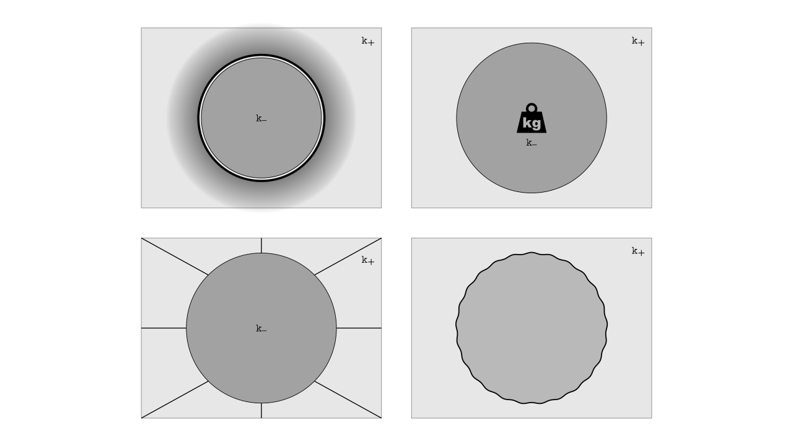 | 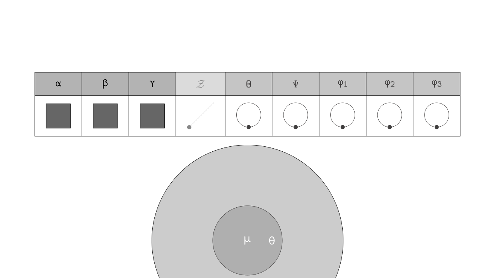 |
| 🌿 **green_mint** | 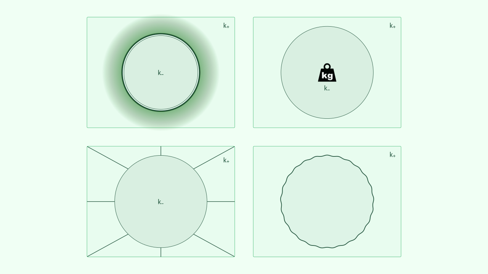 | 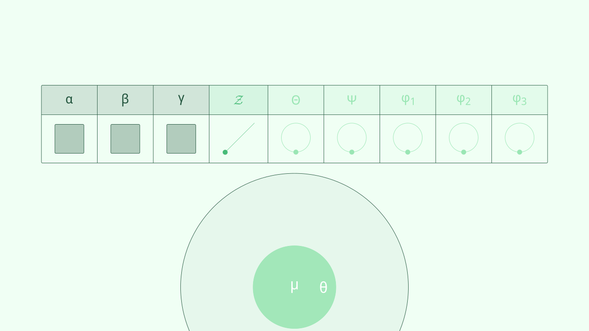 |
| 🧊 **blue_ice** | 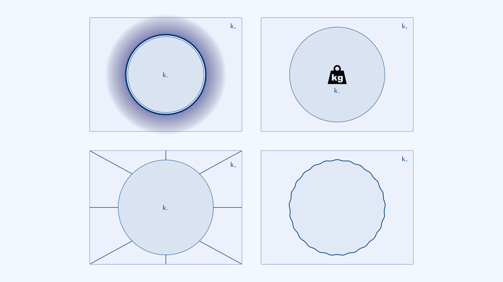 | 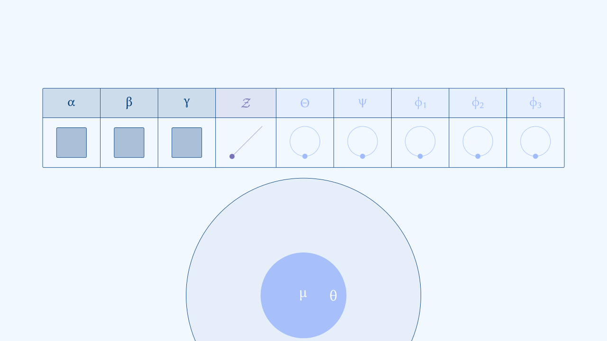 |
| 🍂 **red_autumn** | 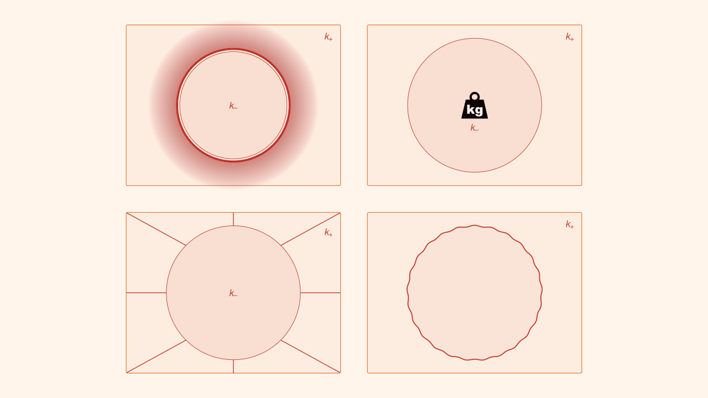 | 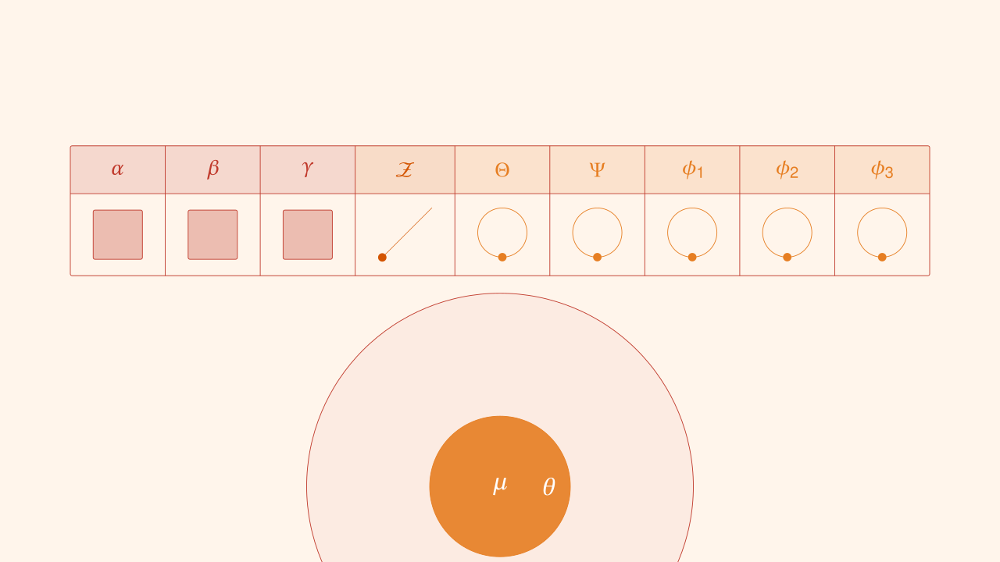 |
| 🔵 **beamer_blue** | 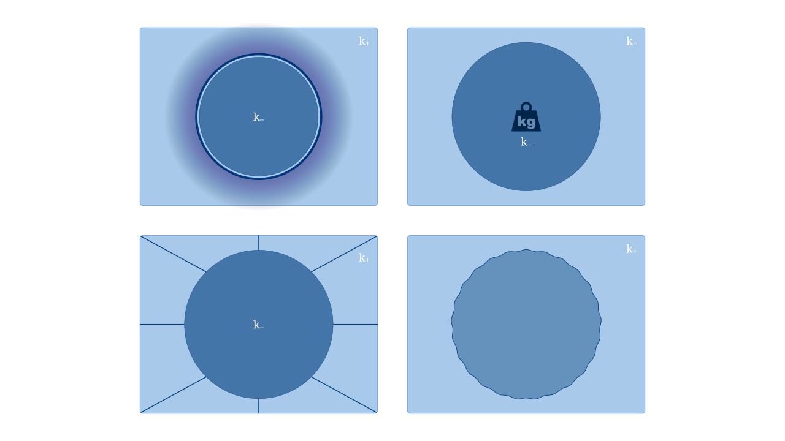 | 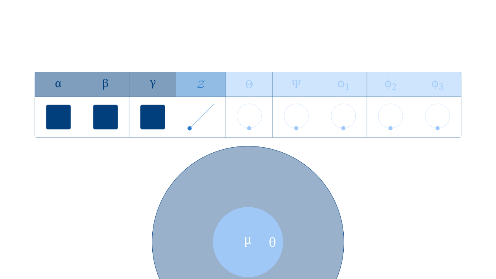 |
| 🟢 **beamer_green** | 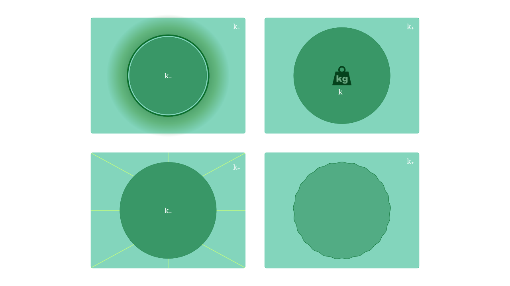 | 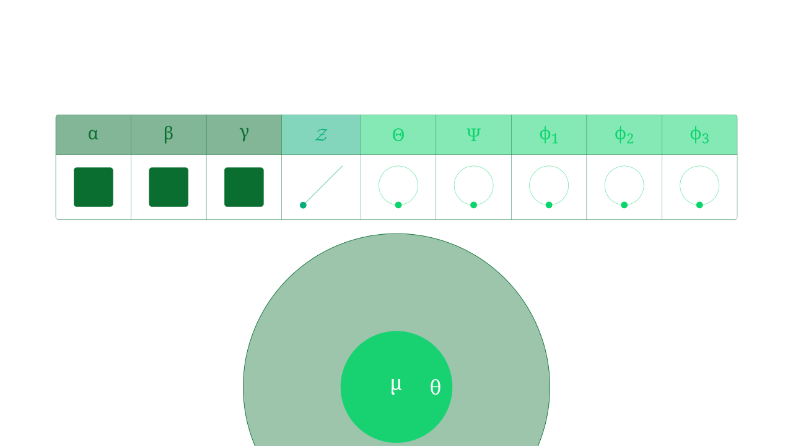 |
| 🌌 **quantum_dusk** | 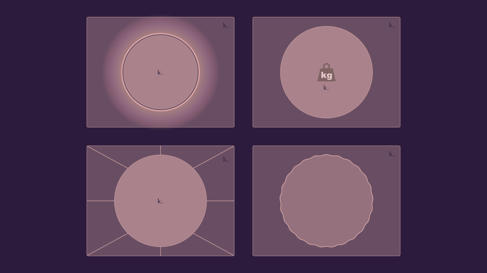 |  |
| ⚫ **dark_energy** | 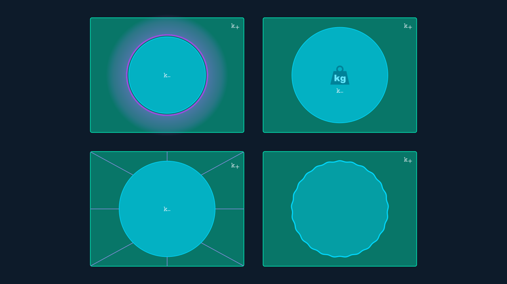 | 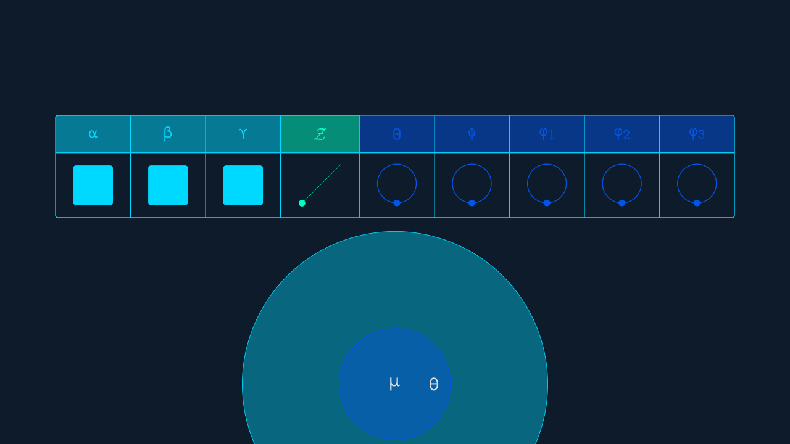 |

</div>


## Installation

### Prerequisites

Make sure you have:
- Python 3.10 or higher
- [Manim Community Edition](https://docs.manim.community/en/stable/installation.html)
- Git

### Install String Cosmology Communication

To **install** this library:

```bash
git clone https://github.com/PanoPepino/string_cosmo_communication

pip install string_cosmo_communication/ .
```

To **use** in your Manim files:

```python
from manim import *
from manim_string_cosmo import *
```

For detailed usage instructions and API reference, visit the [📚 documentation](https://panopepino.github.io/string_cosmo_communication/).


## Contributing

Contributions are welcome! Whether you:

- Have ideas for new strin cosmo and related animations
- Want to add color templates
- Found bugs or have suggestions
- Want to improve documentation

Please open an issue or submit a pull request on [GitHub](https://github.com/PanoPepino/string_cosmo_communication/issues).


## Acknowledgments

Special thanks to:

- The [Manim Community](https://www.manim.community/) for creating such a powerful animation engine
- Jérome Eertmans for the excellent [Manim-Slides](https://manim-slides.eertmans.be/) package
- The Swampland community for working hard to understand the true nature of quantum gravity


## 💖 Support My Work

If you find this project helpful, consider supporting its development. Thank you!

<p align="center">
  <a href="https://www.buymeacoffee.com/panopepino" target="_blank">
    
  </a>
</p>


<!--
Change Log:

2025/12/02: - Created images of all templates.
            - Created example of objects of string cosmo and uploaded to webpage.
            - Added guidelines to create previous slides.
            - Modified README to display templates.


2025/12/01: - Corrected some docstrings from some classes (Tables and Plots)
            - Some web corrections.

2025/11/29: - Templates and color palettes updated.
            - Colors adjusted.
            - Docstrings corrected.
      


TO DO LIST:

- To move table_energy_scales and table_summary to beanim dictionaries.
- Fix issue with gravitational waves in some colors.
- Adjust opacities and widths of strokes.

>